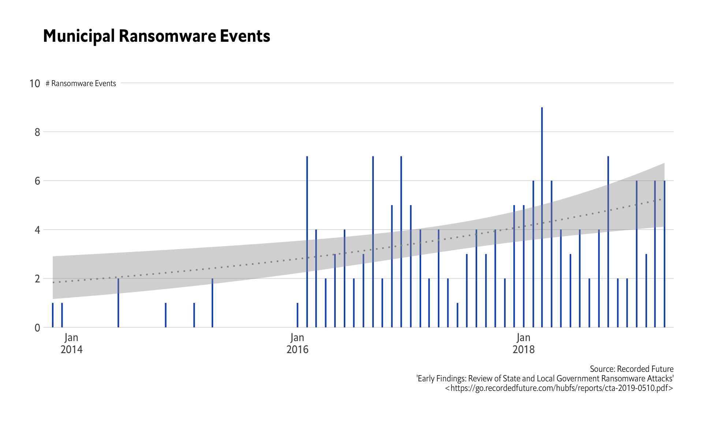
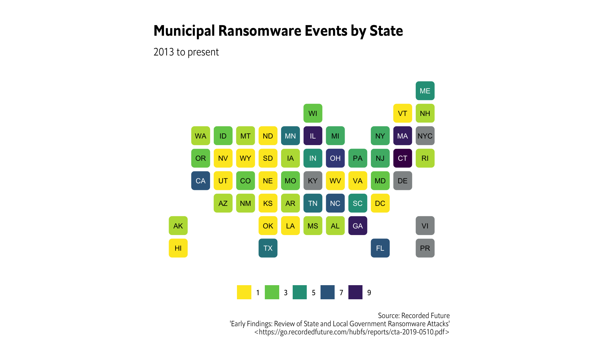
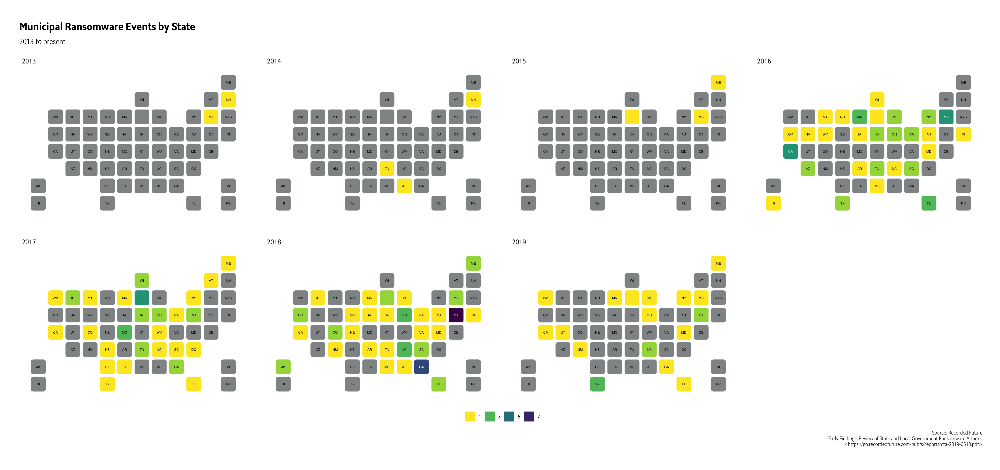
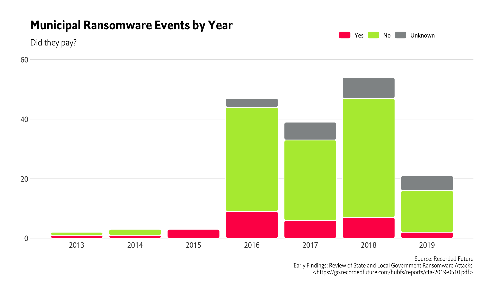
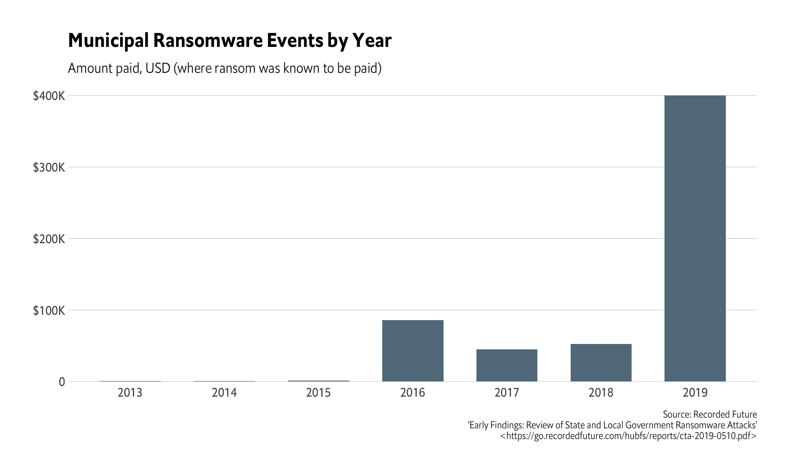

```r
library(glue)
library(pdftools)
library(stringi)
library(hrbrthemes)
library(ggchicklet) # install.packages("ggchicklet", repos = "https://cinc.rud.is")
library(statebins) # install.packages("statebins", repos = "https://cinc.rud.is")
library(tidyverse)
```

```r
rdf <- readRDS(here::here("data/muni-ransomware.rds"))
```

```r
count(rdf, year, month) %>% 
  mutate(
    date = as.Date(glue("{month} 01 {year}"), "%b %d %Y")
  ) %>% 
  ggplot(aes(date, n)) +
  geom_segment(
    aes(xend=date, yend=0), color = ft_cols$blue, size = 0.75
  ) +
  geom_smooth(
    method = "glm", method.args = c(family=quasipoisson),
    color = ft_cols$gray, size = 0.75, linetype = "dotted", se = TRUE
  ) +
  geom_label(
    data = data.frame(),
    aes(as.Date("2013-10-01"), 10, label = "# Ransomware Events"),
    family = font_es_light, size = 3, hjust = 0, vjust = 0.5,
    label.size = 0
  ) +
  scale_x_date(
    expand = c(0,0), date_labels = "%b\n%Y", 
    limits = as.Date(c("2013-10-01", "2019-05-01"))
  ) +
  scale_y_comma(breaks = seq(0, 10, 2), limits = c(0, 11)) +
  labs(
    x = NULL, y = NULL,
    title = "Municipal Ransomware Events",
    caption = "Source: Recorded Future\n'Early Findings: Review of State and Local Government Ransomware Attacks'\n<https://go.recordedfuture.com/hubfs/reports/cta-2019-0510.pdf>"
  ) +
  theme_ipsum_es(grid="Y")
```



```r
count(rdf, state) %>% 
  complete(state = statebins:::b_state_coords$abbrev) %>% 
  ggplot(aes(state = state, fill = n)) +
  geom_statebins() +
  scale_fill_viridis_c(
    name = NULL, direction = -1, na.value = ft_cols$gray,
    breaks = seq(1, 10, 2), limits = c(1, 10)
  ) +
  guides(
    fill = guide_legend(nrow = 1)
  ) +
  coord_equal() +
  labs(
    x = NULL, y = NULL,
    title = "Municipal Ransomware Events by State",
    subtitle = "2013 to present",
    caption = "Source: Recorded Future\n'Early Findings: Review of State and Local Government Ransomware Attacks'\n<https://go.recordedfuture.com/hubfs/reports/cta-2019-0510.pdf>"
  ) +
  theme_ipsum_es(grid="") +
  theme(legend.position = "bottom") +
  worldtilegrid::theme_enhance_wtg()
```



```r
count(rdf, year, state) %>% 
  complete(
    state = statebins:::b_state_coords$abbrev,
    year = unique(year)
  ) %>% 
  ggplot(aes(state = state, fill = n)) +
  geom_statebins(lbl_size = 2) +
  scale_fill_viridis_c(
    name = NULL, direction = -1, na.value = ft_cols$gray,
    breaks = seq(1, 10, 2), limits = c(1, 8)
  ) +
  guides(
    fill = guide_legend(nrow = 1)
  ) +
  coord_equal() +
  facet_wrap(~year, nrow = 2) +
  labs(
    x = NULL, y = NULL,
    title = "Municipal Ransomware Events by State",
    subtitle = "2013 to present",
    caption = "Source: Recorded Future\n'Early Findings: Review of State and Local Government Ransomware Attacks'\n<https://go.recordedfuture.com/hubfs/reports/cta-2019-0510.pdf>"
  ) +
  theme_ipsum_es(grid="") +
  theme(legend.position = "bottom") +
  worldtilegrid::theme_enhance_wtg()
```



```r
mutate(rdf, paid = case_when(
  paid == TRUE ~ "Yes",
  paid == FALSE ~ "No",
  is.na(paid) ~ "Unknown"
)) %>% 
  count(year, paid) %>% 
  mutate(paid = factor(paid, levels = c("Yes", "No", "Unknown"))) %>% 
  ggplot(aes(year, n)) +
  geom_chicklet(aes(fill = paid)) +
  scale_x_continuous(
    breaks = 2013:2019
  ) +
  scale_y_comma(limit = c(0, 60)) +
  scale_fill_manual(
    name = NULL, 
    values = c(
      "Yes" = ft_cols$red,
      "No" = ft_cols$green,
      "Unknown" = ft_cols$gray
    )
  ) +
  labs(
    x = NULL, y = NULL,
    title = "Municipal Ransomware Events by Year",
    subtitle = "Did they pay?",
    caption = "Source: Recorded Future\n'Early Findings: Review of State and Local Government Ransomware Attacks'\n<https://go.recordedfuture.com/hubfs/reports/cta-2019-0510.pdf>"
  ) +
  theme_ipsum_es(grid="Y") +
  theme(legend.position = c(0.8, 1.125)) +
  theme(legend.direction = "horizontal")
```



```r
filter(rdf, paid) %>% 
  count(year, wt = demand) %>% 
  ggplot(aes(year, n)) +
  geom_col(width = 0.65, fill = ft_cols$slate) +
  scale_x_continuous(breaks = 2013:2019) +
  scale_y_comma(
    labels = c(0, "$100K", "$200K", "$300K", "$400K")
  ) +
  labs(
    x = NULL, y = NULL,
    title = "Municipal Ransomware Events by Year",
    subtitle = "Amount paid, USD (where ransom was known to be paid)",
    caption = "Source: Recorded Future\n'Early Findings: Review of State and Local Government Ransomware Attacks'\n<https://go.recordedfuture.com/hubfs/reports/cta-2019-0510.pdf>"
  ) +
  theme_ipsum_es(grid="Y")
```




---
title: "charts.R"
author: "bob"
date: "2019-07-30"
---
